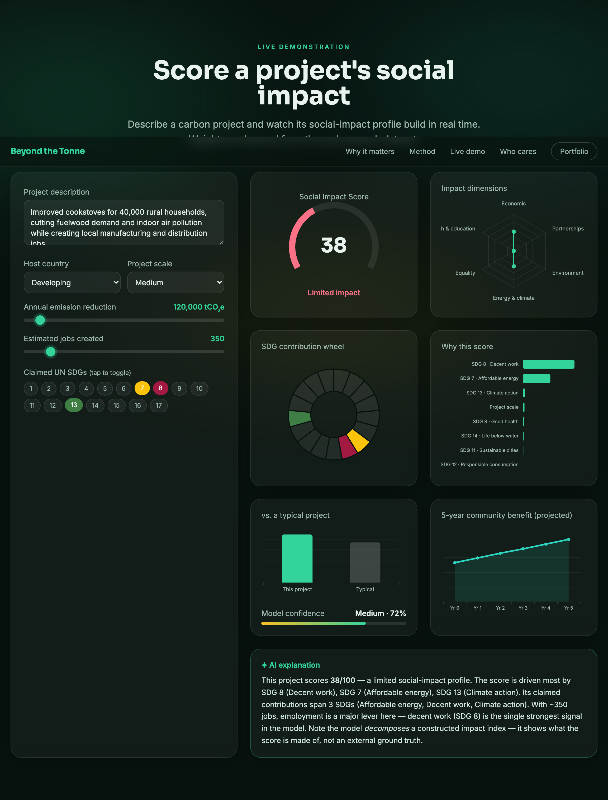

# Beyond the Tonne — Social Impact for Carbon Credits

**An interactive research platform that quantifies the *social* impact of carbon-credit projects — combining project characteristics, UN SDG indicators and AI.**

**Live: https://drishtantleuva.github.io/social-impact-platform/**

A tonne of CO₂ avoided says nothing about the community that hosted the project. This platform tells that story and lets anyone score a project's social impact in real time — from my UTS Master of Analytics (Research) and Springer book chapter on verifying UN SDG claims in carbon-credit projects.

## What it does

- **A guided narrative** — from the carbon-only blind spot, through why social impact matters, to the research method and a live demo.
- **Real-time scoring** — describe a project (country, scale, emission reduction, jobs, claimed SDGs) and watch a full impact dashboard build: social-impact score gauge, impact-dimension radar, an SDG contribution wheel, a "why this score" breakdown, a baseline comparison, a confidence meter, a 5-year projection, and an AI-written explanation.
- **The AI SDG auditor** — the actual GPT-4 prompt-ladder outputs (zero-shot → contrastive chain-of-thought) from the research, auditing a real project's SDG claims with reasoning.
- **Why it matters** — framed for investors, governments, carbon markets and project developers.

## How the scoring works

The live prediction runs entirely in the browser. The weights are a Ridge model fit on the **real research dataset of 161 carbon-credit projects** (log-transformed social-impact index), exported to JavaScript — so the platform is a single static site, free to host, instant to load. The index is a *constructed composite* (from SDG alignment, emission reduction and proxy variables), so the model **decomposes** it (what drives the score) rather than predicting an external outcome — stated plainly in the app.

## Stack

Vanilla HTML + Tailwind (CDN) + ECharts (CDN), client-side scoring in `app.js`. No build step, no backend, no API key.

---

Built by **Drishtant Leuva** — Data Scientist · ESG, explainable ML & GenAI. From my UTS master's research.
[LinkedIn](https://www.linkedin.com/in/drishtant-leuva/) · drishtantl@gmail.com
